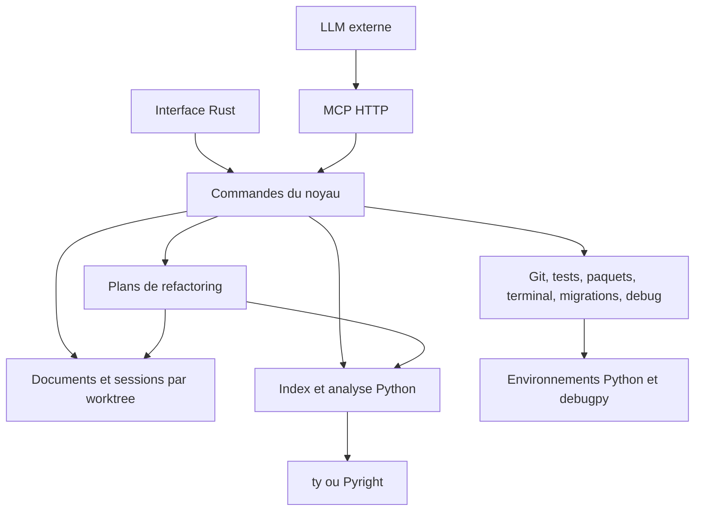

# Proposed architecture for pie_crust

Status: target architecture updated on September 10, 2026. The initial implementation exists in the `pie_crust-core`, `pie_crust-mcp`, and `pie_crust-desktop` crates. The [README](../README.md) precisely distinguishes available features from next steps; the sections below also describe the target product.

## 1. Product and structural decisions

pie_crust is a Rust desktop IDE for working on Python projects, especially Django projects. Users can read and modify files, search, navigate between typed callers, refactor, run tests, debug, and switch worktrees. Its LLM uses the same operations through an HTTP MCP server.

The business core must be independent of the interface. An action launched by shortcut, button, or MCP must produce the same result and obey the same preconditions. MCP is part of the product's first increment.

Decisions confirmed by the user: explicit typing also defines the scope of refactorings. Ineligible uses are neither searched for additionally nor modified; tests reveal breakage, then the fix includes the missing typing. The migration view must make heads not yet merged easy to find and open each migration's file directly when its node is clicked. Each worktree has its own index file; these files are stored in the project's `.pie_crust` folder.

Windows and macOS are first-class target platforms, with a similar interface. Intel Mac and Apple Silicon are included in the build matrix. Defaults favor portable interfaces and replaceable adapters. Application code is in Rust. Specialized external tools, such as debugpy, can run in a Python environment. This does not imply rewriting the debugger or package managers.

The core is a Rust library, initially used in the same process as the interface and MCP. Long-running analyses and operations use workers; language and debug servers are supervised subprocesses. An autonomous daemon can be extracted later without moving business rules into the transport.

## 2. Proposed technical choices

| Area | Initial choice | Rationale and caveat |
| --- | --- | --- |
| Native interface | egui/eframe; wgpu by default, glow optional | Same Windows/macOS view code, rendering independent of system widgets; ability to replace the interface while keeping the core. |
| Text editing | Versioned documents owned by the core; `String` in the first increment, rope possible later | Documents exist independently of the widget; selection, edit history, modified files, and MCP commands share their identities. |
| Syntax | syntect for current highlighting; Tree-sitter planned for syntax analysis | Incremental parsing and syntax selection to be integrated. Symbol resolution remains another layer. |
| Python language | Rust LSP client, ty adapter by default | Completion, diagnostics, definition, references, rename, and call hierarchy according to negotiated capabilities. Pyright adapter possible per project. |
| Typed navigation | pie_crust annotation index + semantic adapter | Preserve explicit type provenance and reject insufficiently resolved bindings. |
| Search | One SQLite file per worktree in `.pie_crust/indexes/`, with paths/symbols and trigrams; exact candidate verification | Physical index isolation; a word-based full-text index is insufficient for code fragments and punctuation. |
| Files | notify, traversal with ignore, globset rules | Incremental updates with reconciliation after lost events. |
| Refactorings | Versioned modification plans; LSP-assisted rename within the typed scope; specialized Rust transformations afterward | Same eligibility rule as navigation, same application engine for UI and MCP. |
| Processes | Tokio, structured program/arguments/environment specification | Cancellation, output streams, supervision, and attachment to a worktree. |
| Terminal | portable-pty + VT emulator + native rendering | PTY provides the system terminal; ANSI parsing, grid, and rendering remain to be integrated. |
| Git | Git CLI with machine output | Respect existing worktrees, hooks, and configuration; dedicated parsers and asynchronous calls. |
| Packages | uv adapter first, adaptation to the existing manager | Do not automatically migrate a pip, Poetry, or other project. |
| Debug | Rust DAP client + debugpy | Launch and network or PID attachment, according to platform capabilities. |
| Previews | Markdown rendered in Rust; HTML through Wry/WebView2 on Windows | Native HTML engine is a specialized dependency. Its integration with the windowing system must be validated early. |
| HTTP MCP | Official rmcp + Rust HTTP router | Streamable HTTP transport and version negotiation handled by the SDK. |

Implementation starts with egui/eframe to provide a common renderer on both platforms. The interface uses wgpu by default; the `renderer-glow` feature compiles an OpenGL variant. The core does not depend on egui. Tests and acceptance recipes must verify keyboard, IME, Unicode characters, selection, clipboard, scrolling, and resizing on the target systems. Initial document size limits are explicit.

Sources: [eframe](https://docs.rs/eframe/0.36.2/eframe/), [egui](https://github.com/emilk/egui), [Tree-sitter](https://tree-sitter.github.io/tree-sitter/), [ty language server](https://docs.astral.sh/ty/features/language-server/), [portable-pty](https://docs.rs/portable-pty/latest/portable_pty/), [Wry](https://github.com/tauri-apps/wry), [Rust MCP SDK](https://github.com/modelcontextprotocol/rust-sdk).

## 3. Code and data organization

Logical split; start with few crates and extract adapters when they become substantial:

```text
crates/
  pie_crust-core/        documents, worktrees, commandes, versions, événements
  pie_crust-analysis/    parsing, catalogue, recherche, politique d’appelants
  pie_crust-refactor/    préconditions, plans, application, journal, undo
  pie_crust-adapters/   LSP, Git, processus, tests, paquets, DAP, migrations
  pie_crust-mcp/        schémas MCP et adaptation vers le noyau
  pie_crust-desktop/    vues et raccourcis
```



Each document has a `worktree_id`, a `document_id`, a canonical path, a buffer, a monotonic version, its on-disk state, and its history. Symbol identities include the worktree, module, and declaration; a name alone is never an identity.

A `snapshot_id` identifies the document and analysis versions used by an operation. A request executed after changing worktrees does not reuse a result from the old context. The core emits versioned events; views ignore stale responses. Workers have bounded queues and can cancel work made obsolete by a new request.

Internal positions: UTF-8 byte offsets with a line index. Grapheme boundaries are handled by the editor; Tree-sitter offsets and LSP positions are converted explicitly according to the negotiated encoding. Saving preserves supported encoding and line endings; an unsupported file opens read-only with an explanation.

Modified buffers take precedence over disk in navigation and refactorings. An external modification triggers version comparison and, if necessary, conflict resolution. Saving and applying patches must never silently overwrite an external modification.

### Storage in `.pie_crust`

The `.pie_crust` folder is centralized at the project's main root. All worktrees registered for this project use this location; its resolution does not depend on the currently displayed worktree. For a bare repository or an organization without a main checkout, opening the project explicitly sets this location once and keeps it in the local registry.

```text
<projet>/.pie_crust/
  config.toml                  configuration partageable
  worktrees.json               registre local : identités et chemins des worktrees
  indexes/
    wt-a1b2.sqlite             index du premier worktree
    wt-c3d4.sqlite             index du deuxième worktree
  sessions/
    wt-a1b2.json               onglets, positions et état de session
    wt-c3d4.json
  recovery/
    wt-a1b2/                  buffers non sauvegardés et journal des opérations
    wt-c3d4/
  logs/
    wt-a1b2/
    wt-c3d4/
```

The schema identifiers are abbreviated examples. Each real identifier is opaque, assigned once, and recorded with the Git identity and canonical path of the worktree. The branch is not an identity: changing branches keeps the worktree's index file but triggers reconciliation of its contents. Moving a worktree updates the registry using its Git identity when available; a new ambiguous association is reindexed rather than attached to a presumed cache.

Each SQLite file contains the file, trigram, symbol, annotation, call-relation, and analysis-metadata tables for its one worktree only. The registry does not contain a shared code index. The LSP engine is also attached to a separate worktree session; its internal state is not reused as another worktree's state.

The file contains a schema version, worktree identity, analyzer versions, configuration/interpreter fingerprint, and source hashes. These values determine invalidation. Rebuilding or corrupting one worktree's index does not affect the others. Rebuilding occurs in a temporary file in the same folder, then replaces the old index after validation and coordinated connection handling.

Only one writer is allowed per index file, with coordinated concurrent reads. SQLite can create technical `-wal` and `-shm` files beside its database while it is in use; they remain in `indexes/`. The registry and sessions also use coordinated writes between processes. Deleting a closed index is possible because it is reconstructible; this principle does not apply to unsaved buffers or recovery logs.

Indexes, sessions, recovery, logs, and the local registry are ignored by Git. `.pie_crust/config.toml` remains versionable and contains no secrets. `.pie_crust/` is always excluded from code traversal and indexing so that the IDE does not index its own operational files. This internal exclusion remains independent of user rules for project folders.

## 4. Search and exclusions

Three index structures answer different needs: file paths, text content, symbols, and semantic relations. They all reside in the SQLite file for the relevant worktree. Trigrams select candidate files for literal search; every result is verified against content corresponding to the displayed version. A query that is too short or a regex with no usable literal falls back to a bounded, interruptible scan.

At startup, quickly display the restored session and catalog freshness status. Initial indexing progresses in the background. Later, parse modified files and invalidate their semantic dependents; a change to an imported signature must not leave callers in other files stale. Revalidate hashes after interruption, configuration changes, and lost watcher events.

The two requested exclusions are independent:

| Search allowed | Indexing allowed | Behavior |
| --- | --- | --- |
| Yes | Yes | Accelerated search and analysis available. |
| No | Yes | Data available for analysis, but hidden from search results and MCP search tools. |
| Yes | No | On-demand scan search; no content or symbol data kept in the pie_crust index. |
| No | No | Folder absent from both traversals; direct opening remains possible. |

Rules are rooted at the worktree, use normalized separators, and explicitly support case differences according to the system. A directory exclusion removes its entire subtree. The interface offers two independent checkboxes: “Exclude from search” and “Exclude from indexing”.

Suggest exclusions for `.git`, `.venv`, Python caches, and build outputs, then make their rule visible and editable. `.gitignore` is a configurable rule source, not a confidentiality boundary. Changing an exclusion removes data that is no longer allowed and cancels corresponding jobs.

The “indexing” scope means pie_crust indexes. An external language server may need to read an imported module to resolve a type, even if the module is excluded from its diagnostics. The interface must distinguish this from a total access prohibition; do not promise isolation that the LSP adapter does not provide. A deliberately opened non-indexed file can be analyzed in memory for editing, without indexing its folder.

## 5. Annotation-eligible callers

The need is a **static call hierarchy**. It represents relationships that code and types allow us to resolve. The **actual call stack** is the one from an execution paused in the debugger.

Proposed strict policy:

1. The target function has an explicitly annotated signature: parameters and return, with the normal exception of `self` and `cls`. Signatures from an explicit `.pyi` may count.
2. A direct call must resolve to a precise declaration, taking scopes and import aliases into account. Textual similarity is not enough.
3. A method or callable call must have an explicitly declared type for the receiver or callable reference. Inference alone, `Any`, `Unknown`, or an unconstrained callable does not satisfy this rule.
4. Annotations needed for the binding must not conceal an unresolved ambiguity. Unions, Protocols, and overrides can designate a contract or several possible targets: do not present them as a certain runtime implementation.
5. Each relation keeps the annotation provenance, linked declarations, and analyzed versions. Without sufficient proof, the edge is ineligible.

Example:

```python
class Billing:
    def charge(self, amount: int) -> bool:
        return amount > 0

def checkout(service: Billing) -> bool:
    return service.charge(100)  # liaison annotée et résolue

def legacy(service):
    return service.charge(100)  # pas d’arête dans la navigation stricte
```

Eligibility applies to the target and the types needed to resolve the binding. It does not automatically require the entire caller function to be annotated when a direct call is already resolved; that is a separate product rule that must not be added implicitly.

ty currently provides LSP call-hierarchy operations, but LSP does not guarantee explicit type provenance. The annotation index therefore supplements LSP candidates. If standard requests are insufficient, a semantic adapter must obtain declared types and snapshots. Pyright's Type Server offers these categories of requests; it is an option to evaluate, with its Node process and its own versioned contract. [ty](https://docs.astral.sh/ty/features/language-server/) ; [Pyright Type Server](https://github.com/microsoft/pyright/blob/main/docs/type-server.md).

The screen displays “no eligible callers found” when the result is empty. It does not conclude that no callers exist. Indexing still in progress or a technical error in the eligible scope is reported; the normal presence of untyped uses is not incomplete analysis and does not trigger a warning. Transforming decorators, `getattr`, monkey patching, dynamic imports, and dynamic parts of Django can prevent resolution despite the presence of annotations.

## 6. Refactorings within the typed scope

Navigation and refactorings use the same explicit-annotation eligibility rule. Refactoring modifies the targeted declaration and eligible uses. An untyped use remains unchanged, even if it subsequently breaks: this consequence is accepted by the user. No additional search for untyped uses, rejection, warning, or confirmation is added solely because they may exist.

The development loop is: refactor typed code, run tests, fix failures, and add missing annotations to affected uses. Tests are the intended way to reveal this breakage. The engine does not try to prove that untyped uses were preserved. A failure caused by an untyped use does not automatically roll back the refactoring: it starts the planned correction loop.

Shared pipeline: capture a snapshot; resolve the selection or symbol; select eligible uses; verify preconditions within that scope; produce a plan and its diff; analyze in-memory changes; apply if versions still match; reindex and publish events; run tests according to the project configuration. Existing diagnostics are distinguished from regressions introduced in eligible transformations. Errors from untyped uses discovered later by tests or diagnostics feed the correction loop without challenging the refactoring's eligibility.

A plan contains the operation, worktree, `typed_only` scope, source files and versions, proposed changes, applicable preconditions, validation result, and a plan identifier. It does not count ignored untyped uses because it does not perform an additional search to inventory them. Preparing a plan changes no files. The interface displays the diff; MCP can inspect and then apply this same plan. A configurable policy permits autonomous application of certain operations; preview does not require systematic human approval.

Multifile application uses a journal, prepared writes, and incident recovery. Do not claim that a file system provides a global atomic transaction: the IDE instead guarantees conflict detection, journaling, controlled restoration, and grouped undo. Undo also refuses to overwrite incompatible later modifications. A stale operation is recalculated, never force-applied.

| Operation | Expected handling | Cases to reject or handle explicitly |
| --- | --- | --- |
| Rename a function | Typed declaration, eligible references, aliases and imports needed by eligible uses, compatible overrides within the scope | Name collision or inconsistent modification in the typed scope. |
| Move code | Declaration, source/destination imports, eligible references, and global dependencies needed by moved code | Introduced import cycle, changed import side effects, access to a closure or context inaccessible in the transformation. |
| Reorder parameters | Signature and affected positional calls that satisfy typing eligibility | `/`, `*`, default values, overload, and override within the scope; ineligible uses remain unchanged. |
| Positional arguments to kwargs | Bind each argument to its exact parameter and name admissible arguments | Positional-only parameters, unknown signature, collision with `**kwargs`. |
| Kwargs to positional arguments | Follow signature order, completing only situations demonstrated to be valid | Gap in parameters, keyword-only parameters, changed evaluation. |
| Sort named arguments | Explicit policy: signature order or alphabetical order | Side effects, observable order of a `**kwargs` dictionary; no blind sorting. |
| Extract a function | Compute inputs, outputs, scope, and insertion point | `return`, `break`, `continue`, `yield`, `await`, captures, and unsupported exit paths. |
| Inline the body | Substitute arguments once, rename local variables, preserve returns | Recursion, defaults evaluated at definition, closure, async/generator, effect order. |

“sortedargs” is not a standard Python primitive. The proposal decomposes it into kwargs → positional conversion according to the signature and explicit kwargs sorting. Its exact meaning remains to be confirmed before implementing this command.

Python evaluates expressions from left to right. Thus rewriting `f(a(), b())` as `f(y=b(), x=a())` can change the result. A refactoring must preserve evaluation order, use temporaries if that preserves the context, or reject the transformation. Even sorting kwargs can change an observable order. [Python evaluation order](https://docs.python.org/3/reference/expressions.html#evaluation-order).

The Rust trajectory calls for an initial LSP-assisted rename, followed by a range-based binding and rewrite engine that preserves comments and formatting. An LSP rename `WorkspaceEdit` can include ineligible uses: it must not be applied as-is. The planner attaches changes to eligible declarations and uses, with necessary import adjustments. If the server cannot produce this scope coherently, the planner builds changes from indexed typed symbols. It does not trigger a global fallback search for untyped uses.

Tree-sitter alone does not provide flow analysis or behavior preservation for eligible transformations. Another trajectory, if external Python refactoring engines are accepted, is to adapt Rope and LibCST to accelerate coverage; their results must follow the same typed scope and core preconditions. [Rope](https://rope.readthedocs.io/en/latest/overview.html) ; [LibCST](https://libcst.readthedocs.io/en/latest/why_libcst.html).

## 7. One-click tests and custom commands

A button in the gutter or next to a test name triggers the associated runner. Syntax detection quickly provides likely tests; a framework collection adapter provides the actual identifiers, including parameterized tests and plugins. Collection may execute project code: it is a visible, cancelable task distinct from passive parsing.

The runner is defined by an executable, argument list, working directory, and environment variables. Placeholders are substituted argument by argument, then passed to the process without shell interpretation. Thus a test name containing spaces, brackets, or special characters remains one argument.

| Placeholder | Value |
| --- | --- |
| `{workspace_root}` | Absolute root of the selected worktree. |
| `{python}` | Interpreter configured for this worktree. |
| `{file_path}` | Absolute file path. |
| `{relative_file}` | Path relative to the worktree root. |
| `{file_name}` | File name with extension. |
| `{file_stem}` | File name without extension. |
| `{test_name}` | Test function or method name. |
| `{test_class}` | Test class, if one exists. |
| `{node_id}` | Exact identifier provided by pytest, including its parameters. |
| `{test_dotted}` | Dotted identifier provided by the unittest/Django adapter. |
| `{line}` | Test line, base 1. |

An unknown or unavailable placeholder produces a precise message, never a silently empty string. Literal braces are escaped with `{{` and `}}` in templates. The test name is not reconstructed by simply splitting the path: Python import rules and runner rules can differ.

Presets: pytest via `python -m pytest {node_id}`, uv project via `uv run --locked python -m pytest {node_id}`, Django via `python manage.py test {test_dotted}`, unittest via `python -m unittest {test_dotted}`. The “file”, “class”, and “suite” variants have their own arguments. A custom runner can invoke Docker, a script, or another tool; its container paths require an explicit mapping.

The configuration always shows the expanded command and its worktree. A separate shell mode may allow pipes and redirections, but it does not implicitly reuse structured-mode string substitution. Results include a status, exit code, bounded output with access to the complete log, and cancellation of the process group. A structured adapter provides individual results; an arbitrary runner has at least its output and overall result.

## 8. Worktrees, Git, terminal, and packages

A worktree has its own session: buffers, tabs, positions, interpreter, environment, index, terminals, launch configurations, LSP server, and debug sessions. Changing worktrees activates another session and restores its layout. Unsaved modifications remain in their original session. Checkout, stash, or discarding changes is not part of this simple navigation.

Already-running tasks continue in their original worktree, identified in their output. An MCP command must always target an explicit `worktree_id`; it does not depend on global context that could change between requests. Inactive sessions can release memory and connections; resuming them reloads their own `.pie_crust/indexes/<worktree_id>.sqlite` file. Worktree indexes remain physically separate, without a shared code catalog.

Git: list worktrees with path, branch or detached HEAD, and status; paginated log with full hash and parents for tracing the graph, author, date, and subject; commit selection and diff. Use unambiguous delimited machine output and options to disable pager/colors. No parsing of localized human presentation.

Terminal: configurable shell started in the worktree with its environment. It must support interactive input, resizing, Ctrl+C, Unicode, and full-screen programs. A pane displaying only stdout is not an integrated terminal.

Packages: display declared constraints, locked versions, and installed versions separately. For uv, prepare the lockfile change in a temporary location compatible with local paths, show the direct and transitive dependency diff, then apply and synchronize on request. Respect version constraints; a proposal for a major constraint change is a separate operation. Solver conflicts and synchronization failures remain visible. [uv locking and synchronization](https://docs.astral.sh/uv/concepts/projects/sync/).

Do not share a mutable Python environment by default between worktrees with divergent lockfiles. Processes never retroactively change cwd or interpreter when another session becomes active.

## 9. Migration graphs

The common model is a directed graph: identified nodes, dependencies, branches, heads, resolution errors, and data provenance. The file graph is available without a database. Applied database state is an additional layer, unknown until the environment has been inspected.

For Django: identifier `(app_label, migration_name)`; interpret literal dependencies, `run_before`, squash replacements, and cross-application dependencies. Computed dependencies and those depending on settings are marked unresolved. Multiple leaves in one application indicate a potential conflict; the diagnosis becomes confirmed when Django's effective loader graph is available. Runtime mode is an explicit task in the project environment because loading Django can execute code and consult a database.

For Alembic: discover all version directories declared by `version_locations` in the selected configuration, resolving relative paths and traversal options; use the conventional directory only when no override applies. Read `revision`, `down_revision`, `branch_labels`, and `depends_on` without executing the module when their values are literal. Differentiate revision ancestry from auxiliary dependencies. Display databases, branches, and merge revisions. Multiple heads can be intentional: the confirmed need is to make heads not yet merged easy to find, without systematically calling them conflicts. A project policy can specify one expected head or multiple allowed branches. Do not automatically produce a merge migration.

The view shows a counter of current heads, a selectable list, and a “View heads” action that frames the graph's endpoints and their branches. Each head node has a visual marker and merges remain visible. The calculation starts from the current endpoints of the revision graph: a historical divergence already joined by a merge is not reported as a head still needing to be merged. Independent databases are grouped separately and `depends_on` dependencies are distinguished from `down_revision` ancestry.

Clicking any node directly opens that migration's file at its declaration, in the correct worktree for review. Clicking an entry in the heads list frames its node and opens the same file. The path belongs to the node model, with no attempt to infer it solely from the displayed name.

In both cases: detect cycles, missing parent, duplicate identifier, and dynamic metadata. An incomplete view must not be displayed as a verified graph.

Sources: [Django migrations](https://docs.djangoproject.com/en/stable/topics/migrations/), [Alembic branches](https://alembic.sqlalchemy.org/en/latest/branches.html).

## 10. Debugging and previews

The DAP client handles script/module launch, attachment to a local debugpy address, and PID attachment when supported. PID attachment is not guaranteed for every process: permissions, platform, and interpreter state can prevent it. Configurations keep interpreter, cwd, arguments, environment variables, and path mappings. The Django reloader and subprocesses imply multiple linked debug sessions.

Minimum view: verified/unverified breakpoints, threads, actual stack, scopes/variables loaded progressively, continue, stepping, step in/out, stop, and detach. Evaluating expressions in the debugger can have effects in the process. Stopping a launched program and detaching from an existing program are two different actions. [debugpy](https://github.com/microsoft/debugpy/blob/main/README.md), [CLI reference](https://github.com/microsoft/debugpy/wiki/Command-Line-Reference).

Markdown: render synchronized with the current buffer, navigation to headings, and controlled resolution of relative images/links. Static HTML: web engine with project resources, refresh on modification, and no bridge granting access to IDE commands. A local Django/FastAPI server URL provides the actual dynamic rendering; displaying an isolated Django template is not enough to calculate its context, filters, or views.

Local previews do not receive the MCP token. Their origins and resource access remain separate from those of the IDE API. Their content must not be able to invoke refactorings through a privileged JavaScript interface.

## 11. HTTP MCP contract

Example address: `http://127.0.0.1:43127/mcp`, with configurable port. The rmcp SDK supports Streamable HTTP and negotiation with compatible versions. Transport parameters must conform to the chosen version; do not code an ad hoc JSON route and present it as an MCP server.

The service listens on the loopback interface by default, requires local token authentication outside the repository, verifies Host and Origin, and does not allow paths outside registered worktrees. Canonicalization handles symbolic links and junctions. Remote exposure would require its own authentication and TLS configuration; it is not part of local launch. The specification notably requires Origin validation. [MCP Streamable HTTP transport](https://modelcontextprotocol.io/specification/2026-07-28/basic/transports/streamable-http).

Proposed tools, whose names are pie_crust contracts to implement:

| Tool | Main inputs | Result |
| --- | --- | --- |
| `workspace_list` | Pagination | Known worktrees, identities, state, and active session. |
| `workspace_focus` | `worktree_id`, request identifier | Activated session or impossible action. |
| `editor_focus` | `worktree_id`, path, line/column or range | Open file, selection, and interface acknowledgment. |
| `document_read` | `worktree_id`, path, range, optional version | Current buffer content and version. |
| `code_search` | `worktree_id`, query, mode, limit, cursor | Paginated results and freshness, respecting search exclusions. |
| `symbol_callers` | `worktree_id`, target, and version | Eligible callers, evidence, and completeness status. |
| `refactor_prepare` | `worktree_id`, operation, target/selection, parameters, snapshot | `typed_only` scope plan, diff, and validation of eligible changes. |
| `refactor_apply` | `plan_id`, idempotency key | Applied changes and new versions, or conflict. |
| `refactor_undo` | `operation_id`, expected versions | Grouped undo, or conflict. |
| `migration_graph` | `worktree_id`, adapter, scope | Nodes, edges, heads, and resolution problems. |
| `job_status` | `job_id`, output cursor | Progress or result of a long-running operation. |
| `job_cancel` | `job_id` | Cancellation requested, then final state. |

All tools provide an input schema, structured errors, and precise descriptions. Long responses are paginated or available as MCP resources. Long tasks return an identifier, then use progress mechanisms supported by the client. Notifications are not the only way to retrieve the result.

`refactor_apply` applies exclusively the already calculated plan: the API does not receive a new series of free-form replacements that would bypass preconditions. The typed scope is identical to the interface's; MCP does not additionally search for untyped uses and does not request confirmation about them. A client retrying the same idempotency key receives the state of the same operation without applying the patch twice. Any drift in documents, relevant environment, or analysis invalidates the plan.

The core distinguishes business success from bringing a window to the foreground through the system. `editor_focus` waits for the UI acknowledgment and reports a possible OS focus refusal; if the interface is not connected, it does not claim to have displayed the file. Reading or refactoring a worktree does not change the visible session; only focus tools do that.

Local log: tool, client, worktree, operation identifier, affected files, and result. No token in logs, and no complete buffer content by default. Arbitrary shell commands are not part of the initial MCP contract; test or debug tools may later target named configurations.

## 12. Uncertainties to resolve with prototypes

1. Ergonomics and cost of the native editing component, especially IME, Unicode, and large files.
2. Amount of semantic information exposed by the chosen engine to prove annotation provenance; measure actual coverage on a typed Python project and a Django project.
3. Exact contract of “sortedargs” and accepted latitude for temporaries during a transformation.
4. WebView integration with egui windows on Windows and macOS; Linux remains a later possibility.
5. Option of an external Rope/LibCST engine, or requirement that all transformations themselves be Rust.

These questions do not prevent defining documents, snapshots, worktree identity, commands, and refactoring plans. They must be resolved before investing in broad transformation coverage and final editor rendering.
